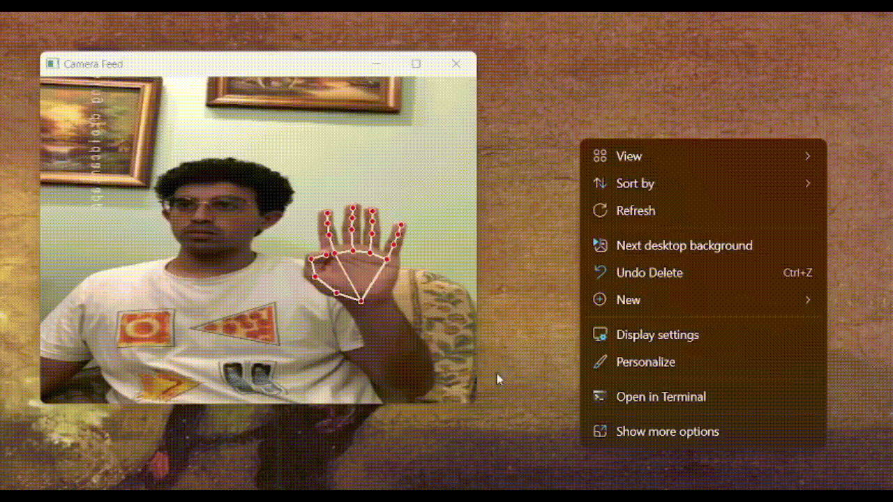

# Hand Gesture Mouse Control

## Overview

Hand Gesture Mouse Control allows you to control your computer mouse through hand gestures detected via a camera feed. It uses MediaPipe for hand landmark detection and `pynput` for mouse control, supporting gestures for movement, left-click, right-click, and double-click.

## Features

- Real-time hand gesture detection with MediaPipe.
- Mouse movement, left-click, right-click, and double-click control.
- Customizable gesture recognition.

## Requirements

- Python 3.7 or higher
- `opencv-python`
- `mediapipe`
- `pynput`
- `screeninfo`
- `numpy`

Install the required packages with:

```bash
pip install -r requirements.txt
``` 


## Files

### `main.py`

Captures video from the camera, processes hand landmarks, and controls the mouse based on gestures.

### `utils.py`

Contains functions and classes for hand landmark processing and mouse control:
- **`format_landmarks(hand_landmarks)`**: Converts MediaPipe hand landmarks to a NumPy array of (x, y) coordinates.
- **`calculate_angle(A, B, C)`**: Calculates the angle between three points.
- **`get_distance(landmark1, landmark2)`**: Computes the distance between two landmarks.
- **`MouseController`**: Class with methods to:
  - **`move_mouse(x, y)`**: Move the mouse to (x, y) coordinates.
  - **`left_click()`**: Perform a left-click.
  - **`right_click()`**: Perform a right-click.
  - **`double_click()`**: Perform a double-click.

## Usage

1. Ensure your camera is connected.
2. Run `main.py`:

    ```bash
    python main.py
    ```

Control the mouse with gestures:
- **Move Mouse**: Based on index finger position (landmark 8).
- **Left Click**: When the index finger is up and thumb is farther away.
- **Right Click**: When the index finger is down and thumb is closer.
- **Double Click**: Based on thumb and finger positions.

Press 'q' to exit the application.

## Troubleshooting

- Ensure all required packages are installed.
- Check camera functionality.
- Adjust gesture recognition logic in `main.py` and `utils.py` as needed.


## Real-time Work

### 1. Right-click Gesture

The following GIF demonstrates how to perform a right-click action using hand gestures:


### 2. Move Mouse and Left-click

The following GIF shows how to move the mouse and perform a left-click action:




### 3. Move Mouse and Double-click

The following GIF illustrates how to move the mouse and perform a double-click action:


